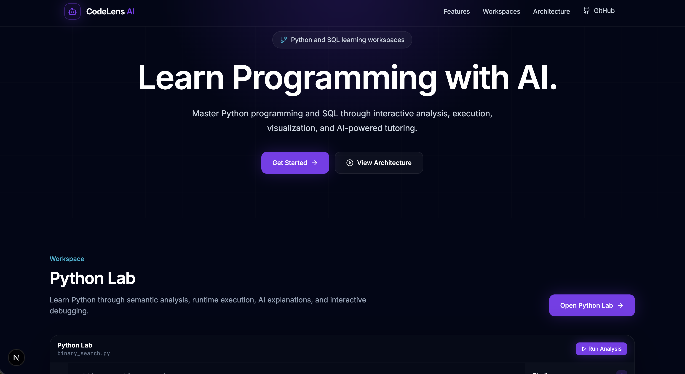
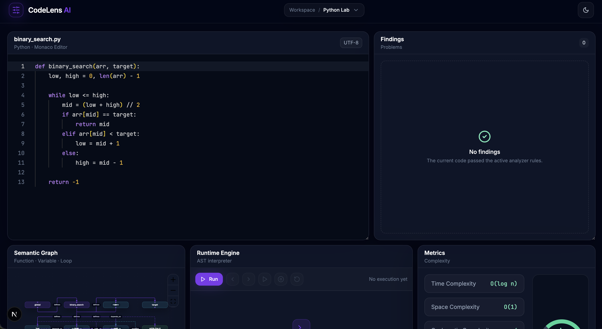
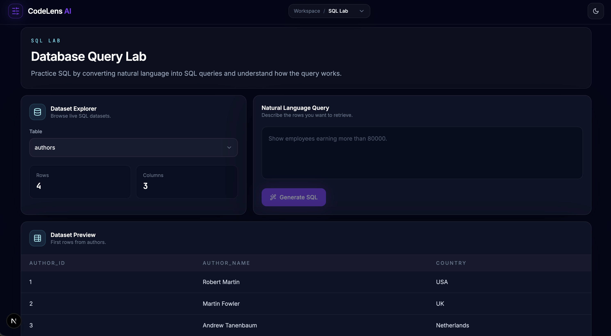

# 🚀 CodeLens AI

**AI-Powered Programming & Database Learning Platform**

CodeLens AI is an AI-powered learning platform that helps students master Python programming and SQL through interactive analysis, visualization, and intelligent tutoring.


## About

CodeLens AI combines deterministic program analysis with AI-powered explanations to make programming concepts easier to understand, debug, and explore.

The platform includes two learning environments:

- **Python Lab** for code analysis, runtime visualization, complexity metrics, fixes, and AI explanations.
- **SQL Lab** for schema-aware SQL generation, validation, execution, and tutoring.

## Preview

### Landing Page



### Labs

| Python Lab | SQL Lab |
| --- | --- |
|  |  |

## Features

### 🐍 Python Lab

- Static Semantic Analysis
- Runtime Visualization
- Complexity Metrics
- AI Code Explanation
- Suggested Code Fixes
- Interactive Learning

### 🗄 SQL Lab

- Natural Language → SQL
- Schema-aware SQL Generation
- SQL Validation
- SQL Execution
- AI SQL Tutor
- Dataset Explorer
- Result Visualization

## Technology Stack

| Layer | Technology |
| --- | --- |
| Frontend | Next.js 15, TypeScript, Tailwind CSS, React Query, Monaco Editor, React Flow |
| Backend | FastAPI, Pydantic, NetworkX, Python 3.11+ |
| SQL Engine | SemanticSQL, FastAPI, SQLAlchemy, sqlglot |
| AI Runtime | Ollama |
| AI Models | `qwen3:4b`, `llama3.1:8b`, `qwen2.5:7b` |
| Database | SQLite |

## Project Structure

```text
CodeLens-AI/
├── backend/          # Python Lab API, analyzer, runtime, AI explanations
├── sql_backend/      # SQL Lab API, SQL generation, validation, tutoring
├── frontend/         # Next.js application
├── setup.sh          # One-time local setup helper
├── cleanup.sh        # Optional helper for freeing occupied local ports
├── run.sh            # Starts local development services
├── stop.sh           # Stops services started by run.sh
├── status.sh         # Shows local service status
└── README.md
```

## Quick Start

```bash
git clone https://github.com/dhruvak99/CodeLens-AI.git
cd CodeLens-AI

chmod +x setup.sh cleanup.sh run.sh stop.sh status.sh

./setup.sh
```

Start Ollama in a separate terminal:

```bash
ollama serve
```

Run the application:

```bash
./cleanup.sh      # Optional, frees occupied CodeLens AI ports
./run.sh
```

Use `cleanup.sh` only when ports `3000`, `8000`, or `8001` are already occupied by stale CodeLens AI processes.

Stop the application:

```bash
./stop.sh
```

Check service status:

```bash
./status.sh
```

Open the application:

```text
http://localhost:3000
```

> **Note:** For the best experience, open CodeLens AI in an **Incognito/Private browsing window**. This avoids browser extension interference and cached editor state that can occasionally affect the Monaco editor.

## Manual Setup

If you do not want to use the helper scripts, you can manually start each service:

- **Backend:** create `backend/.venv`, install backend dependencies, then run FastAPI on port `8000`.
- **SQL Backend:** create `sql_backend/.venv`, install SQL backend dependencies, then run FastAPI on port `8001`.
- **Frontend:** run `npm install` inside `frontend/`, then start Next.js on port `3000`.

## AI Models

| Purpose | Model |
| --- | --- |
| Python code explanations | `qwen3:4b` |
| SQL generation | `llama3.1:8b` |
| SQL tutoring explanations | `qwen2.5:7b` |

## Roadmap

### Completed

- [x] Python Lab
- [x] SQL Lab
- [x] AI SQL Tutor
- [x] Runtime Visualization
- [x] Schema-aware SQL Generation

### Planned

- [ ] User Authentication
- [ ] Progress Tracking
- [ ] Learning Dashboard
- [ ] PostgreSQL Support
- [ ] Additional Programming Languages
- [ ] Docker Support
- [ ] Cloud Deployment

## Contributing

Contributions are welcome. If you want to improve CodeLens AI, open an issue, propose an enhancement, or submit a pull request with a focused change.

## License

This project is licensed under the terms described in the repository [LICENSE](LICENSE) file.
